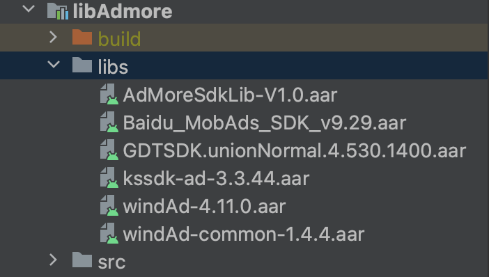

# AdMoreSdk - Android接入文档

[TOC]

## 1.SDK接入

### 1.1引入方式

#### 1.1.1 以module方式引入（推荐）

新建module 删除res下的文件（重要！！ 避免一些AAPT错误）

新module中导入aar以及gradle配置

//aar导入如图（参考项目中imgs下aarlibs.png）



gradle配置如图

```
//主App的gradle配置
android{
    repositories {
        flatDir {
            dirs 'libs'
            dirs project(':libAdmore').file('libs')
        }
    }
}
dependencies{  
        //替换为您项目导入的module名称，此处引用的是lib
    implementation project(':libAdmore')
}

//lib module的gradle配置
android{
    repositories {
        flatDir {
            dirs 'libs'
        }
    }
}  
dependencies{    
        implementation fileTree(include: ['*.jar'], dir: 'libs')

    implementation "com.pangle.cn:mediation-sdk:5.3.5.1"//穿山甲
    implementation "com.pangle.cn:mediation-ks-adapter:3.3.44.1"//ks adapter
    implementation "com.pangle.cn:mediation-baidu-adapter:9.29.1"//baidu adapter
    implementation "com.pangle.cn:mediation-gdt-adapter:4.530.1400.1" //gdt adapter
    implementation "com.pangle.cn:mediation-sigmob-adapter:4.11.0.1"//sigmob adapter

    api(name: 'AdMoreSdkLib-V1.0', ext: 'aar')
    //Baidu
    implementation(name: 'Baidu_MobAds_SDK_v9.29', ext: 'aar')
//    //GDT 优量汇
    implementation(name: 'GDTSDK.unionNormal.4.530.1400', ext: 'aar')
//    //ks 快手
    implementation(name: 'kssdk-ad-3.3.44', ext: 'aar')
//    //sigmob
    implementation(name: 'windAd-4.11.0', ext: 'aar')
    implementation(name: 'windAd-common-1.4.4', ext: 'aar')
}
```

注：如遇aapt打包问题可删除新建module下的res文件夹

#### 1.1.2直接主Module导入SDK依赖的aar包以(gradle配置)

参考demo中的配置

```gradle
//admore  
    implementation "com.pangle.cn:mediation-sdk:5.6.0.8"//穿山甲
    implementation "com.pangle.cn:mediation-ks-adapter:3.3.51.1.1"//ks adapter
    implementation "com.pangle.cn:mediation-baidu-adapter:9.313.2"//baidu adapter
    implementation "com.pangle.cn:mediation-gdt-adapter:4.540.1410.2" //gdt adapter
    implementation "com.pangle.cn:mediation-sigmob-adapter:4.12.6.1"//sigmob adapter

api(name: 'AdMoreSdkLib-V1.0.2', ext: 'aar')
//    //Baidu
    implementation(name: 'Baidu_MobAds_SDK_v9.313', ext: 'aar')
//    //GDT 优量汇
    implementation(name: 'GDTSDK.unionNormal.4.540.1410', ext: 'aar')
//    //ks 快手
    implementation(name: 'kssdk-ad-3.3.51.1', ext: 'aar')
//    //sigmob
    implementation(name: 'windAd-4.12.6', ext: 'aar')
    implementation(name: 'windAd-common-1.4.9', ext: 'aar')
```

```
根目录gradle配置仓库
allprojects {
    repositories {              
                  maven {
            url 'https://artifact.bytedance.com/repository/pangle'
        }
        maven {
            url 'https://dl-maven-android.mintegral.com/repository/mbridge_android_sdk_support/'
        }
        }
}
```

### 1.2 必要权限以及menifest配置

###### 权限相关

    <!-- 必要权限 -->
        <uses-permission android:name="android.permission.INTERNET" /> <!-- 可选权限 -->
        <uses-permission android:name="android.permission.READ_PHONE_STATE" />
        <uses-permission android:name="android.permission.ACCESS_NETWORK_STATE" />
        <uses-permission android:name="android.permission.WRITE_EXTERNAL_STORAGE" />
        <uses-permission android:name="android.permission.ACCESS_WIFI_STATE" />
        <uses-permission android:name="android.permission.ACCESS_COARSE_LOCATION" />
        <uses-permission android:name="android.permission.REQUEST_INSTALL_PACKAGES" />
        <uses-permission android:name="android.permission.VIBRATE" /> <!-- suppress DeprecatedClassUsageInspection -->
        <uses-permission android:name="android.permission.GET_TASKS" />
        <uses-permission
            android:name="android.permission.WAKE_LOCK"
            tools:node="remove" />
        <!-- 可选，穿山甲提供“获取地理位置权限”和“不给予地理位置权限，开发者传入地理位置参数”两种方式上报用户位置，两种方式均可不选，添加位置权限或参数将帮助投放定位广告 -->
        <!-- 请注意：无论通过何种方式提供给穿山甲用户地理位置，均需向用户声明地理位置权限将应用于穿山甲广告投放，穿山甲不强制获取地理位置信息 -->
        <uses-permission android:name="android.permission.ACCESS_FINE_LOCATION" /> <!-- demo场景用到的权限，不是必须的 -->
        <uses-permission android:name="android.permission.RECEIVE_USER_PRESENT" />
        <uses-permission android:name="android.permission.SYSTEM_ALERT_WINDOW" />
        <uses-permission android:name="android.permission.EXPAND_STATUS_BAR" /> <!-- 建议添加“query_all_package”权限，穿山甲将通过此权限在Android R系统上判定广告对应的应用是否在用户的app上安装，避免投放错误的广告，以此提高用户的广告体验。若添加此权限，需要在您的用户隐私文档中声明！ -->
        <uses-permission android:name="android.permission.QUERY_ALL_PACKAGES" />
        <uses-permission android:name="android.permission.RECORD_AUDIO" />

###### 必要配置

         <provider
                android:name="com.baidu.mobads.sdk.api.BdFileProvider"
                android:authorities="${applicationId}.bd.provider"
                android:exported="false"
                android:grantUriPermissions="true">
                <meta-data
                    android:name="android.support.FILE_PROVIDER_PATHS"
                    android:resource="@xml/bd_file_paths" />
            </provider>
            <!-- baidu end================== -->
            <!-- GDT start================== -->
            <!-- targetSDKVersion >= 24时才需要添加这个provider。provider的authorities属性的值为${applicationId}.fileprovider，请开发者根据自己的${applicationId}来设置这个值，例如本例中applicationId为"com.qq.e.union.demo"。 -->
            <provider
                android:name="com.qq.e.comm.GDTFileProvider"
                android:authorities="${applicationId}.gdt.fileprovider"
                android:exported="false"
                android:grantUriPermissions="true">
                <meta-data
                    android:name="android.support.FILE_PROVIDER_PATHS"
                    android:resource="@xml/gdt_file_path" />
            </provider>
    
            <activity
                android:name="com.qq.e.ads.PortraitADActivity"
                android:configChanges="keyboard|keyboardHidden|orientation|screenSize"
                android:screenOrientation="portrait" />
            <activity
                android:name="com.qq.e.ads.LandscapeADActivity"
                android:configChanges="keyboard|keyboardHidden|orientation|screenSize"
                android:screenOrientation="landscape"
                tools:replace="android:screenOrientation" />
    
            <!-- 声明SDK所需要的组件 -->
            <service
                android:name="com.qq.e.comm.DownloadService"
                android:exported="false" />
            <!-- 请开发者注意字母的大小写，ADActivity，而不是AdActivity -->
    
            <activity
                android:name="com.qq.e.ads.ADActivity"
                android:configChanges="keyboard|keyboardHidden|orientation|screenSize" />
            <!-- GDT end================== -->
            <!-- sigmob start================== -->
            <activity
                android:name="com.sigmob.sdk.base.common.AdActivity"
                android:configChanges="keyboard|keyboardHidden|orientation|screenSize"
                tools:replace="android:theme"
                android:theme="@style/sig_transparent_style" />
    
            <provider
                android:name="com.sigmob.sdk.SigmobFileProvider"
                android:authorities="${applicationId}.sigprovider"
                android:exported="false"
                android:grantUriPermissions="true">
                <meta-data
                    android:name="android.support.FILE_PROVIDER_PATHS"
                    android:resource="@xml/sigmob_provider_paths" />
            </provider>
            <!-- sigmob end================== -->
            <!--   tools:replace 去除其他包索引引起的merger failed   -->
            <provider
                android:name="com.bytedance.sdk.openadsdk.TTFileProvider"
                android:authorities="${applicationId}.TTFileProvider"
                android:exported="false"
                android:grantUriPermissions="true">
                <meta-data
                    android:name="android.support.FILE_PROVIDER_PATHS"
                    android:resource="@xml/file_paths" />
            </provider>
            <provider
                android:name="com.bytedance.sdk.openadsdk.multipro.TTMultiProvider"
                android:authorities="${applicationId}.TTMultiProvider"
                android:exported="false" />
    
            <provider
                android:name="com.bytedance.sdk.openadsdk.TTFileProvider"
                android:authorities="${applicationId}.TTFileProvider"
                android:exported="false"
                android:grantUriPermissions="true">
                <meta-data
                    android:name="android.support.FILE_PROVIDER_PATHS"
                    android:resource="@xml/pangle_file_paths" />
            </provider>
    
            <provider
                android:name="com.bytedance.sdk.openadsdk.multipro.TTMultiProvider"
                android:authorities="${applicationId}.TTMultiProvider"
                android:exported="false" />
            <!-- Pangle end================== -->

在res/xml目录下，新建如下七个xml文件 

pangle_file_paths.xml

```xml/pangle_file_paths.xml
<?xml version="1.0" encoding="utf-8"?>
<paths>
    <external-path name="tt_external_root" path="." />
    <external-path name="tt_external_download" path="Download" />
    <external-files-path name="tt_external_files_download" path="Download" />
    <files-path name="tt_internal_file_download" path="Download" />
    <cache-path name="tt_internal_cache_download" path="Download" />
</paths>
```

gdt_file_path.xml

```xml/gdt_file_path.xml
<?xml version="1.0" encoding="utf-8"?>
<paths>
    <!-- 这个下载路径也不可以修改，必须为com_qq_e_download -->
    <external-cache-path
        name="gdt_sdk_download_path1"
        path="com_qq_e_download" />
    <cache-path
        name="gdt_sdk_download_path2"
        path="com_qq_e_download" />
</paths>
```

bd_file_paths.xml

```xml/bd_file_paths.xml
<?xml version="1.0" encoding="utf-8"?>
<paths xmlns:android="http://schemas.android.com/apk/res/android">
     <external-path name="bd_lv_path" path="/" />
     <external-files-path name="bdpath" path="bddownload/" />
     <external-path name="bdpathsd" path="bddownload/" />
     <files-path name="bd_files_path" path="bddownload/" />
     <cache-path name="bd_cache_path" path="bddownload/" />
</paths>
```

sigmob_provider_paths.xml

```xml/sigmob_provider_paths.xml
<?xml version="1.0" encoding="utf-8"?>
<paths>
    <!-- 这个下载路径不可以修改，SigDownload -->
    <external-cache-path
        name="SigMob_root"
        path="SigDownload" />
    <external-path
        name="SigMob_root_external"
        path="." />
</paths>
```

file_paths.xml

```xml/mb_provider_paths.xml
<?xml version="1.0" encoding="utf-8"?>
<paths>
    <external-path name="tt_external_root" path="." />
    <external-path name="tt_external_download" path="Download" />
    <external-files-path name="tt_external_files_download" path="Download" />
    <files-path name="tt_internal_file_download" path="Download" />
    <cache-path name="tt_internal_cache_download" path="Download" />
</paths>
```

为了适配下载和安装相关功能，在工程中引用的包  `com.android.support:support-v4:24.2.0`  使用24.2.0以及以上版本。

#### 运行环境配置

本SDK可运行于Android4.1 (API Level 16) 及以上版本。

#### OAID 接入

**接入sigmob的广告后**，建议开发者优先集成OAID。Android 10 无法通过常规方式获取IMEI，影响广告测试及正式广告的填充。MSA联盟官网地址: http://www.msa-alliance.cn/col.jsp?id=120建议接入 MSA 1.0.22 版本（demo中接入的版本就是1.0.22）

1. 把 msa_mdid_x.x.x.aar 或者 oaid_sdk_x.x.x.aar 拷贝到项的 libs 目录，并设置依赖，其中 x.x.x 代表版本号。

2. 将 supplierconfig.json 拷贝到项目 assets 目录下，并修改里边对应内容，特别是需要设置 appid 的部分。需要设置 appid 的部分需要去对应厂商的应用商店里注册自己的app。

3. 混淆设置。
   
   #oaid 不同的版本混淆代码不太一致，你注意你接入的oaid版本
    -dontwarn com.bun.**
    -keep class com.bun.** {*;}
    -keep class a.**{*;}
    -keep class XI.CA.XI.**{*;}
    -keep class XI.K0.XI.**{*;}
    -keep class XI.XI.K0.**{*;}
    -keep class XI.vs.K0.**{*;}
    -keep class XI.xo.XI.XI.**{*;}
    -keep class com.asus.msa.SupplementaryDID.**{*;}
    -keep class com.asus.msa.sdid.**{*;}
    -keep class com.huawei.hms.ads.identifier.**{*;}
    -keep class com.samsung.android.deviceidservice.**{*;}
    -keep class com.zui.opendeviceidlibrary.**{*;}
    -keep class org.json.**{*;}
    -keep public class com.netease.nis.sdkwrapper.Utils {public <methods>;}

4. 设置 gradle 编译选项，这块可以根据自己对平台的选择进里合里配置 ，也可以不配置
   
           ndk {
               abiFilters 'armeabi-v7a','arm64-v8a'
           }
           packagingOptions {
               doNotStrip "*/armeabi-v7a/*.so"
               doNotStrip "*/arm64-v8a/*.so"
           }

#### 代码混淆

```混淆相关
-keep class com.admore.* {*;}

##CSJ

-keepclassmembers class * {
 *** getContext(...);
 *** getActivity(...);
 *** getResources(...);
 *** startActivity(...);
 *** startActivityForResult(...);
 *** registerReceiver(...);
 *** unregisterReceiver(...);
 *** query(...);
 *** getType(...);
 *** insert(...);
 *** delete(...);
 *** update(...);
 *** call(...);
 *** setResult(...);
 *** startService(...);
 *** stopService(...);
 *** bindService(...);
 *** unbindService(...);
 *** requestPermissions(...);
 *** getIdentifier(...);
 }

-keep class com.bytedance.pangle.** {*;}
-keep class com.bytedance.sdk.openadsdk.** { *; }
-keep class com.bytedance.frameworks.** { *; }

-keep class ms.bd.c.Pgl.**{*;}
-keep class com.bytedance.mobsec.metasec.ml.**{*;}

-keep class com.ss.android.**{*;}

-keep class com.bytedance.embedapplog.** {*;}
-keep class com.bytedance.embed_dr.** {*;}

-keep class com.bykv.vk.** {*;}

//聚合混淆
-keep class bykvm*.**
-keep class com.bytedance.msdk.adapter.**{ public *; }
-keep class com.bytedance.msdk.api.** {
 public *;
}
-keep class com.bytedance.msdk.base.TTBaseAd{*;}
-keep class com.bytedance.msdk.adapter.TTAbsAdLoaderAdapter{
 public *;
 protected <fields>;
}

  baidu sdk 不接入baidu sdk可以不引入

-ignorewarnings
-dontwarn com.baidu.mobads.sdk.api.**
-keepclassmembers class * extends android.app.Activity {
 public void *(android.view.View);
}

-keepclassmembers enum * {
 public static **[] values();
 public static ** valueOf(java.lang.String);
}

-keep class com.baidu.mobads.** { *; }
-keep class com.style.widget.** {*;}
-keep class com.component.** {*;}
-keep class com.baidu.ad.magic.flute.** {*;}
-keep class com.baidu.mobstat.forbes.** {*;}

#ks 不接入ks sdk可以不引入
-keep class org.chromium.** {*;}
-keep class org.chromium.** { *; }
-keep class aegon.chrome.** { *; }
-keep class com.kwai.**{ *; }
-dontwarn com.kwai.**
-dontwarn com.kwad.**
-dontwarn com.ksad.**
-dontwarn aegon.chrome.**

  Admob 不接入admob sdk可以不引入

-keep class com.google.android.gms.ads.MobileAds {
 public *;
}

#sigmob 不接入sigmob sdk可以不引入
-dontwarn android.support.v4.**
-keep class android.support.v4.** { *; }
-keep interface android.support.v4.** { *; }
-keep public class * extends android.support.v4.**

-keep class sun.misc.Unsafe { *; }
-dontwarn com.sigmob.**
-keep class com.sigmob.**.**{*;}

#oaid 不同的版本混淆代码不太一致，你注意你接入的oaid版本 ，不接入oaid可以不添加
-dontwarn com.bun.**
-keep class com.bun.** {*;}
-keep class a.**{*;}
-keep class XI.CA.XI.**{*;}
-keep class XI.K0.XI.**{*;}
-keep class XI.XI.K0.**{*;}
-keep class XI.vs.K0.**{*;}
-keep class XI.xo.XI.XI.**{*;}
-keep class com.asus.msa.SupplementaryDID.**{*;}
-keep class com.asus.msa.sdid.**{*;}
-keep class com.huawei.hms.ads.identifier.**{*;}
-keep class com.samsung.android.deviceidservice.**{*;}
-keep class com.zui.opendeviceidlibrary.**{*;}
-keep class org.json.**{*;}
-keep public class com.netease.nis.sdkwrapper.Utils {public <methods>;}

#klevin 游可赢
-keep class com.tencent.tgpa.**{*;}
-keep class com.tencent.klevin.**{*;}

#Mintegral 不接入Mintegral sdk，可以不引入
-keepattributes Signature
-keepattributes *Annotation*
-keep class com.mbridge.** {*; }
-keep interface com.mbridge.** {*; }
-keep class android.support.v4.** { *; }
-dontwarn com.mbridge.**
-keep class **.R$* { public static final int mbridge*; }
```

#### 

#### 资源混淆

如果您的应用启用了资源混淆或资源缩减，您需要保留SDK的资源，SDK的资源名都是以tt_mediation_开头的。 您可以在资源混淆配置文件添加如下配置:                

<?xml version="1.0" encoding="utf-8"?>

    <resources
        xmlns:tools="http://schemas.android.com/tools"
        tools:keep="@id/tt_mediation_*,@color/tt_mediation_*,@string/tt_mediation_*" />

<?xml version="1.0" encoding="utf-8"?>

<paths xmlns:android="http://schemas.android.com/apk/res/android">
   <!--为了适配所有路径可以设置 path = "." -->

<?xml version="1.0" encoding="utf-8"?>

<paths xmlns:android="http://schemas.android.com/apk/res/android">
   <!--为了适配所有路径可以设置 path = "." -->

<external-path name="tt_external_root" path="." />
   <external-path name="tt_external_download" path="Download" />
   <external-files-path name="tt_external_files_download" path="Download" />
   <files-path name="tt_internal_file_download" path="Download" />
   <cache-path name="tt_internal_cache_download" path="Download" />
</paths>

<?xml version="1.0" encoding="utf-8"?>

<paths xmlns:android="http://schemas.android.com/apk/res/android">
   <!--为了适配所有路径可以设置 path = "." -->

<external-path name="tt_external_root" path="." />
   <external-path name="tt_external_download" path="Download" />
   <external-files-path name="tt_external_files_download" path="Download" />
   <files-path name="tt_internal_file_download" path="Download" />
   <cache-path name="tt_internal_cache_download" path="Download" />
</paths>

<?xml version="1.0" encoding="utf-8"?>

<paths xmlns:android="http://schemas.android.com/apk/res/android">
   <!--为了适配所有路径可以设置 path = "." -->

## 2.AdMoreSdk初始化

### 2.1 AdMoreSdk初始化

建议在application的onCreate中进行初始化操作

    @Override  
    public void onCreate() {  
        super.onCreate();  
            //由于初始化在子线程，请确保初始化以后再进行下一步操作
            SdMoreManager.init(this,"AppName","AppId");
            //或者
            SdMoreManager.init(this, "AppName", "AppId", new AdMoreSdk.InitCallBack() {
                @Override
                public void success() {
                    adInit = true;
                }
    
                @Override
                public void fail(int i, String s) {
                    adInit = false;
                    Log.d("App", "adInitFailed" + s);
                }
            });        
    }  

SdMoreManager代码如下

    public class SdMoreManager {
            public static void init(Context context, String appName, String appId) {  
                AdMoreSdk.initialize(context, buildV2Config(appName, appId));  
                if (Build.VERSION.SDK_INT >= Build.VERSION_CODES.P) {  
                    String processName = UIUtils.getCurrProcessName(context);  
                    if (!"com.admore.demo".equals(processName)) {  
                        WebView.setDataDirectorySuffix(processName);  
                    }  
                }  
            }  
    
            /**初始化配置类   */  
            public static IAdMoreConfig buildV2Config(String name, String appId) {  
                return buildV2Config(name, appId, BuildConfig.DEBUG);  
            }  
    
            public static IAdMoreConfig buildV2Config(String name, String appId, boolean debug) {
            return new AdMoreConfig.Builder()
                    /**
                     * 注：需要替换成在媒体平台申请的appID ，切勿直接复制
                     */
                    .setAppId(appId)
                    .setAppName(name)
                    /**
                     * 上线前需要关闭debug开关，否则会影响性能
                     */
                    .setDebug(debug)
                    .build();
        }  
    }

### 2.2 AdMoreSdk主要广告说明

###### 广告流程说明

每个广告使用方法类似，统一创建IAdMoreNativeAd 根据不同方法加载不同类型广告，不同广告有自己单独的回调，请参考demo中的实现方式

    IAdMoreNativeAd nativeAd = AdMoreSdk.getAdManager().createNative(Activity);
            IAdMoreSlot adMoreSlot = new AdMoreSlot.Builder()
                    .setCodeId("xxx")
                    .setAdSize(new AdSize(xx,xx)).build();
            nativeAd.loadAd(adMoreSlot,加载回调方法)

#### 2.2.1Banner广告(AdMoreBannerExpressAd)

##### 介绍

横幅⼴告，⼜名Banner⼴告，固定于app顶部、中部、底部、或其他位置，横向贯穿整个app⻚⾯；当⽤户与app互动时，Banner⼴告会停留在屏幕上，并可在⼀段时间后⾃动刷新。

###### 加载方法说明

    IAdMoreNativeAd nativeAd = AdMoreSdk.getAdManager().createNative();
    IAdMoreSlot adMoreSlot = new AdMoreSlot.Builder()
                    .setAdCount(1)
                    .setCodeId("xxx")
                    .setAdSize(new AdSize(xx,xx)).build();
    nativeAd.loadBannerExpressAd(adMoreSlot, new AdMoreBannerExpressAd.IAdMoreBannerCallBack() {
         @Override
         public void onBannerAdLoad(List<AdMoreBannerExpressAd> ads) {
         //此处获取AdMoreBannerExpressAd 对象
         mBannerViewAd = ads.get(0);
         showBanner();
      }
    });

###### 展示说明

    View view = mBannerViewAd.getAdView();
    adMain.addView(view); 

使用参考AdMoreDemo的 BannerActivity类

#### 2.2.2沉浸式视频信息流广告(AdMoreDrawAd)

###### 介绍

与抖⾳竖版视频流⼀样的全屏视频信息流⼴告。

###### 加载方法说明

    IAdMoreNativeAd aNative = AdMoreSdk.getAdManager().createNative(this);
    IAdMoreSlot adMoreSlot = new AdMoreSlot.Builder()
        .setAdCount(1)
        .setCodeId("xx")
        .setOrientation(AdMoreSlot.VERTICAL)
        .setAdSize(new AdSize(xx, xx)).build();
    aNative.loadDrawAd(adMoreSlot, new AdMoreDrawAd.AdMoreDrawLoadListener()){
            @Override
        public void onError(int var1, String message) {
        }
    
        @Override
        public void onDrawFeedAdLoad(List<AdMoreDrawAd> ads) {
                    //拿到AdMoreDrawAd
                adMoreDrawAd = ads.get(0);
            showDrawAd();
        }    
    }

展示说明

    adMoreDrawAd.setAdMoreRenderListener(new AdMoreRenderListener() {
       @Override
       public void onRenderSuccess(View view, float var2, float var3, boolean var4) {
               adMain.removeAllViews();
               View adView = adMoreDrawAd.getAdView();
               if (adView.getParent() != null && adView.getParent() instanceof ViewGroup) {
                        ((ViewGroup) adView.getParent()).removeAllViews();
               }
                    //然后在回调中进行展示
               adMain.addView(adView);
       }
    });
    adMoreDrawAd.render();

使用参考AdMoreDemo的 AdMoreDrawActivity类

#### 2.2.3插全屏⼴告(AdMoreFullScreenAd)

###### 介绍

插全屏⼴告是将原有的插屏⼴告(AdMoreInterstitialAd)和全屏视频⼴告(AdMoreFullscreenVideoAd)结合，在同⼀个⼴告类型下⽀持混出的⼴告类型

###### 加载方法说明

    IAdMoreNativeAd aNative = AdMoreSdk.getAdManager().createNative(this);
    IAdMoreSlot adMoreSlot = new AdMoreSlot.Builder()
         .setAdCount(1)
         .setCodeId("xx")
         .setOrientation(AdMoreSlot.VERTICAL)
         .setAdSize(new AdSize(xx, xx)).build();
    aNative.loadScreenFullAd(adMoreSlot, new AdMoreFullScreenAd.AdMoreScreenFullAdVideoListener() {
      @Override
      public void onFullScreenVideoCached(AdMoreFullScreenAd var1) {
          screenAd = var1;
          showAd();
      }
    });

###### 展示说明

    screenAd.setVideoAdListener //监听回调
    screenAd.show(Activity);

使用参考AdMoreDemo的FullScreenActivity类

#### 2.2.4原⽣信息流⼴告(AdMoreNativeAd)

###### 介绍

原⽣信息流⼴告是由SDK提供渲染完成的view组件，可适⽤于多个场景。原⽣信息流⼴告是由SDK提供渲染完成的view组件，可适⽤于多个场景。

###### 加载方法说明

    IAdMoreSlot adMoreSlot = new AdMoreSlot.Builder()
        .setAdCount(1)
        .setCodeId("xx")
        .setAdSize(new AdSize(xx, xx)).build();
    adMoreNativeAd.loadNativeAd(adMoreSlot, new AdMoreNativeAd.IAdMoreNativeCallBack() {
         @Override
         public void onFeedAdLoad(List<AdMoreNativeAd> ads) {
              nativeAd = ads.get(0);
              showAd();
         }
    });

###### 展示说明

    nativeAd.setRenderListener(new AdMoreRenderListener() {
            @Override
        public void onRenderSuccess(View view, float var2, float var3, boolean var4) {
            View adView = nativeAd.getAdView();
            if (adView.getParent() != null && adView.getParent() instanceof ViewGroup) {
                ((ViewGroup) (adView.getParent())).removeView(view);
            }
              adMain.removeAllViews();
            adMain.addView(adView);
         }
    });
    nativeAd.render();

使用参考AdMoreDemo的 FeedNativeActivity类

### 2.2.5视频激励⼴告(AdMoreRewardAd)

###### 介绍

原⽣信息流⼴告是由SDK提供渲染完成的view组件，可适⽤于多个场景。原⽣信息流⼴告是由SDK提供渲染完成的view组件，可适⽤于多个场景。

###### 加载方法说明

    IAdMoreNativeAd rewardVideoAd = AdMoreSdk.getAdManager().createNative(this);
    IAdMoreSlot adMoreSlot = new AdMoreSlot.Builder()
            .setAdCount(1)
        .setCodeId("xxx")
        .setAdSize(new AdSize(xx,xx)).build();
    rewardVideoAd.loadRewardAd(adMoreSlot, new AdMoreRewardAd.IAdMoreRewardCallBack() {
        @Override
        public void onRewardVideoCached(AdMoreRewardAd ad) {
            Log.d(TAG, "onRewardVideoCached ");
             rewardAd = ad;
              showAd();
                    }
       });

###### 展示说明

    //激励视频相关的回调参考demo
    rewardAd.setRewardAdInteractionListener(new AdMoreRewardAd.RewardAdInteractionListener()）
    //展示
    rewardAd.show(this);

使用参考AdMoreDemo的 RewardActivity类

### 2.2.6开屏⼴告(AdMoreSplashAd)

###### 介绍

开屏⼴告主要是 APP 启动时展示的全屏⼴告视图,展示完毕后⾃动关闭并进⼊应⽤的主界⾯。

###### 加载方法说明

    IAdMoreNativeAd aNative = AdMoreSdk.getAdManager().createNative(this);
       IAdMoreSlot adMoreSlot = new AdMoreSlot.Builder()
          .setCodeId("xx")
              .setAdSize(new AdSize(xx, xx)).build();
    aNative.loadSplashAd(adMoreSlot, new AdMoreSplashAd.IAdMoreSplashCallBack() {
       @Override
       public void onSplashAdLoad(AdMoreSplashAd ad) {
          splashAd = ad;
          showSplash();
       }
    
       @Override
       public void onTimeout() {
           gotoMain();
       }
    });

###### 展示说明

```splash
splashAd.setAdMoreInteractionListener(new AdMoreSplashAd.AdMoreInteractionListener() {
    @Override
    public void onAdSkip() {
        gotoMain();
    }
        @Override
    public void onAdTimeOver() {
                //播放完毕
        gotoMain();
    }
});
//展示
        splashAd.showSplash(adMore);
```

使用参考AdMoreDemo的 SplashActivity类
